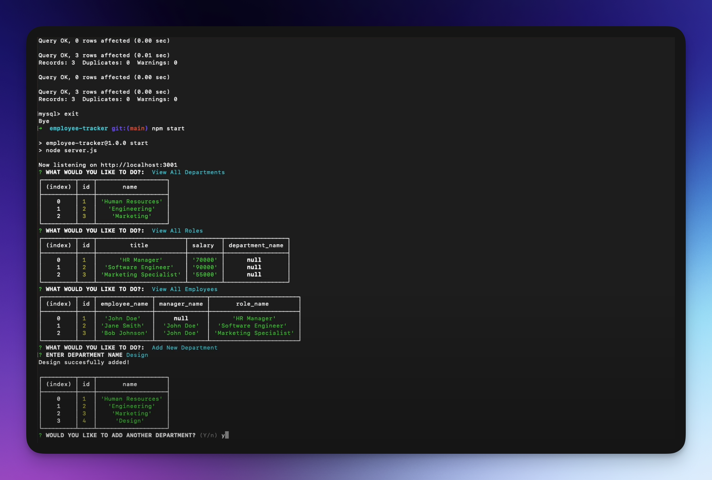

# Employee Tracker
A command-line application from scratch to manage a company's employee database, using Node.js, Inquirer, and MySQL.

## User Story
`AS` A business owner  
`I WANT` to be able to view and manage the departments, roles, and employees in my company  
`SO THAT` I can organize and plan my business  

## Acceptance Criteria
`GIVEN` a command-line application that accepts user input  
`WHEN` I start the application  
`THEN` I am presented with the following options: view all departments, view all roles, view all employees, add a department, add a role, add an employee, and update an employee role  
`WHEN` I choose to view all departments  
`THEN` I am presented with a formatted table showing department names and department ids  
`WHEN` I choose to view all roles  
`THEN` I am presented with the job title, role id, the department that role belongs to, and the salary for that role  
`WHEN` I choose to view all employees  
`THEN` I am presented with a formatted table showing employee data, including employee ids, first names, last names, job titles, departments, salaries, and managers that the employees report to  
`WHEN` I choose to add a department  
`THEN` I am prompted to enter the name of the department and that department is added to the database  
`WHEN` I choose to add a role  
`THEN` I am prompted to enter the name, salary, and department for the role and that role is added to the database  
`WHEN` I choose to add an employee  
`THEN` I am prompted to enter the employee’s first name, last name, role, and manager, and that employee is added to the database  
`WHEN` I choose to update an employee role  
`THEN` I am prompted to select an employee to update and their new role and this information is updated in the database  

## Overview 
The goal of this project was to create a node terminal application that allowed users to manage an employee database for their company. Users can create departments, roles, and employees. Employees can be linked to Roles, and Roles can be linked to Departments. The application uses a node front end with a mysql backend.

[Link to Video Demo](https://www.youtube.com/watch?v=hmYXeBRPUPk&feature=youtu.be)

## Installation
To get started, clone the repository from the provided link. Then, enter the project directory and use your preferred package manager to install the necessary dependencies.

##  Usage
After completing the installation, start the application and run 
`source db/schema.sql` to build the database, then `source db/seeds.sql` to seed the tables. 

## Technologies Used
* node 
* npm 
* mysql
* inquirer

## Reflection 
This project has allowed me to apply the core skills I have recently learned and put them into practice. During development, I had the opportunity to deepen my understanding of the Mysql and Node. Additionally, I developed a deeper appreciation for for the importance code commenting, and the development principal DRY. (Don't repeat yourself). In the future, I would like to to add more functionality that allows users to delete department and roles. I would also like to spend more time DRYing out the code.  